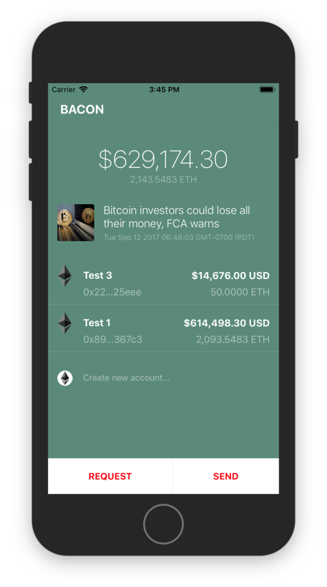

# Bacon Wallet for Mobile

## Getting Started
1. React Native Cli tool: `npm install -g react-native-cli`
2. A local blockchain:
  a. TestRPC `npm install -g ethereumjs-testrpc` and run `testrpc`
  b. Or Geth `brew install geth` and run `geth --dev --rpc --rpcapi="db,eth,net,web3,personal,web3"`
3. `cd bacon-mobile && npm install`
5. `react-native start`

# Do not use this for production Ether yet!
## Work in Progress
Bacon is a project to:
1. Build something substantial using React/React-native
2. Learn the ins and outs of working with the Ethereum network
3. Gain a solid understanding of Redux and passing data around an app
4. Security related to storing encrypted data on a device and management of Ethereum public/private keys
